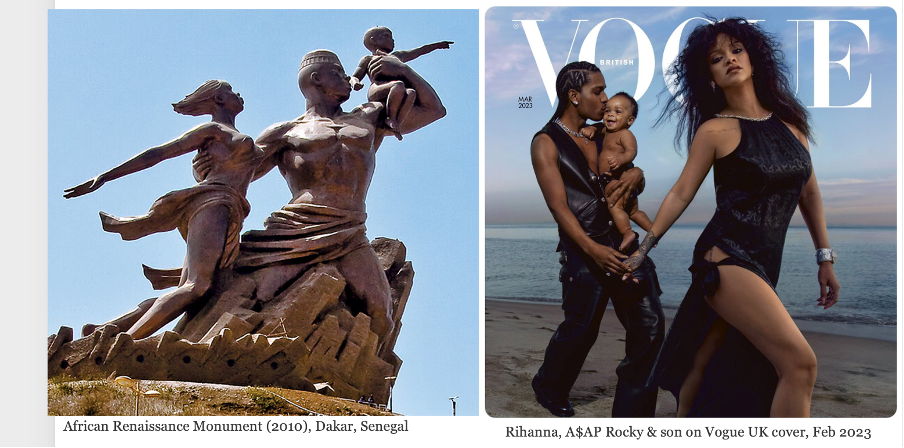

# Gender & Representation
{: .no_toc }

*By Marion Walton & Martha Evans, University of Cape Town*

- TOC
{:toc}

## Gender and representation

The goal of this chapter is to understand and challenge **[hegemonic](definitions.html/hegemony)** models of **sex** and **gender** in the media. We’ll explore the role of gender binaries in everyday language, the visual languages associated with objectification, stereotypes, gender display in advertising and marketing, and gender performativity. Finally, we ask how and to what extent GenerativeAI is perpetuating existing gender biases. 

As discussed earlier, by "gendered [discourse](definitions.html#discourse)" we mean a range of **[practices](definitions.html#media-practices)** which produce categories such as "men", "women" and the relations between them. This includes visual and verbal discourse, as well as how discourse is regulated by social institutions such as neoliberal economies, advertising and marketing, heteronormative families, single-sex schools, separate sporting codes for men and women, medicine, and so on. These **[multimodal](definitions.html#multimodality)** discursive practices work together with structural racism and other social systems to produce and police subject positions in **[intersectional](definitions.html#intersectionality)** ways.

We will consider several examples of gender in the media, noticing repeated patterns in **[normative](definitions.html#normativity)** media representations of masculinity and femininity, and in particular the **[binary oppositions](definitions.html#binary-oppositions)** between them. These examples will show how the semiotic details of visual representations such as photographs, advertising and synthetic media are used to construct gendered **[identities](definitions.html#identity)** and **[ideologies](definitions.html#ideology)** that may support or challenge **[patriarchal social structures](definitions.html#patriarchal-social-structures)**. 

[Discourse](definitions.html#discourse-(foucault)){: .btn .btn-blue }
[Intersectionality](definitions.html#intersectionality){: .btn .btn-blue }

## Gender

​​Feminists have traditionally distinguished between the terms “sex” (used to discuss biological issues) and “gender” (referring to culture and signification).

{: .definition}
Gender refers to “social and cultural roles, personality traits, and behaviours that are deemed **socially acceptable for men and women** in relation to concepts of masculinity and femininity” ([O’Shaughnessy,  Stadler, & Casey, 2016:360](references.html#oshaughnessy_2016)). 

{: .example}

Figure 1 Coca-Cola Advertisement circa 1956. Coca-Cola South Africa Facebook Campaign featuring Tyla in Coke Studio promotion, 2024. | 
The meanings we associate with femininity have changed over time, as illustrated by  the two Coca-Cola ads. What do they show us about how idealised femininities have changed in South Africa since 1956? How do we interpret these identities today? What social changes and governing institutions may have given rise to the change in significations? Do you think we can call both of the ads examples of hegemonic femininity?

The term “gender” was introduced by anthropologist Margaret Mead ([Delphy, 1993](references.html#delphy_1993)) who observed that gender role expectations and the temperaments of men and women in indigenous societies were starkly different to those in the United States at the time.   

 People's understanding of gender changes over time and differs between cultural contexts, as illustrated by the different versions of femininity in the Coca-Cola ads in Figure 1. 

Decolonial scholars have documented how very different gender ideologies and discourses emerge in specific contexts. For example, [Oyewumi (1997)](references.html#oyewumi_1997) argues against imposing Western gender theories (and even the category “woman”) when discussing pre-colonial African societies, noting how scholars interpreted the history of Yoruba society through a patriarchal lens, assuming that leaders were men, while in fact Yoruba women lost many property rights and other powers as a result of colonial rule. 

[Gender](definitions.html#gender){: .btn .btn-blue }

{: .question}
What terms are used to discuss cultural aspects of our gender identities (rather than biological sex)?

Answer

Terms for gender identity include, but are not limited to, woman, man, non-binary, genderqueer, and agender. ([LGBTQ GLOSSARY](https://web.archive.org/web/20230519035630/https://studentaffairs.jhu.edu/lgbtq/education/glossary/)) 

{: .activity}
How does the meaning of “man” and “woman” differ in different contexts and different historical periods? 

## Binary oppositions
{: .definition}
In language, binary oppositions are a system of opposing and mutually exclusive categories or signifiers. 

| More power | Less power |
|------------|------------|
| Man        | Woman      |
| Rational   | Emotional  |
| Strong     | Weak       |

 These binary oppositions underpin **[hegemonic](definitions.html#hegemony)** social hierarchies (e.g. in many contexts “man” has more social power than “woman”, “straight” has more social power than “gay”, “logic” has more social power than “emotion”). 
 
Understanding these binary oppositions in patriarchal discourses can help us to explain many gender **[stereotypes](definitions.html#stereotype)**.  

Furthermore, binary categories work together when people try to enforce **[normative](definitions.html#normativity)** identities. For example, women are expected to be more caring than men, while also being judged for being overly emotional. Because the categories are seen as mutually exclusive, some people find the idea of gender transition a challenging concept. Similarly, when women have physical traits such as muscular shoulders or facial and body hair, this is often enough for people to question their femininity or even their identity as women.

The pressures of binary stereotypes, and the lack of space for non-normative identities is pronounced in languages like English where even personal pronouns specify a gender (“he” vs “she”). This is one of the reasons that some people prefer to use gender-neutral pronouns (e.g. “they, them”).

[Binary oppositions](definitions.html#binary-oppositions){: .btn .btn-blue }

## Man/woman and male/female

When discussing the cultural dimensions of gender, try to avoid the biological terms “male” and “female”, as well as terms which are loaded with sexist assumptions (e.g. “lady”). Instead, use “women” and “men” to refer to people’s **gender identity**. 

It's important to be aware though, that "men" and "women" are often used interchangeably with the biological terms “male” and “female” to construct a **gender binary**. A man/woman opposition is a major organising principle of social and media institutions such as sports and schools, where they are equated with biological terms “male” and “female”.  Used in this binary way, the terms exclude many possible identities, such as trans people who transition from one identity to another, as well as the identities of people who identify as **non-binary.** 

Used inclusively, with an awareness of **[intersectionality](definitions.html#intersectionality)** the terms “women” and “men” provide politically useful ways to challenge **[sexism](definitions.html#sexism)** and [misogyny](definitions.html#misogyny)**, and to encompass critiques of **[cis normativity](definitions.html#cis-normativity)** and gender **[binaries](definitions.html#binary-oppositions)**.

{: .question}
What terms are used to discuss biological aspects of sex (rather than gender)?

Answer

Terms used to discuss biological aspects of sex include, but are not limited to "male", "female" and "intersex".” ([LGBTQ GLOSSARY](https://web.archive.org/web/20230519035630/https://studentaffairs.jhu.edu/lgbtq/education/glossary/)) 

## Gender normativity and the media

{: .definition}
Gender **[normativity](definitions.html#normativity)** involves adhering to or reinforcing hegemonic rules and standards about what kinds of behaviour are allowed for men and women. 

For men, gender normativity is often associated with **hegemonic masculinity**. For women it is linked to the dominant and conventionally “womanly” forms of **femininity**.  These ideals change over time and vary in different contexts. An additional important dimension of gender normativity for both men and women is **heteronormativity**.

### Hegemonic femininity

{: .definition}
Schippers ([2007: 94](references.html#schippers_2007))defines hegemonic feminity as “the characteristics defined as womanly that establish and legitimate a hierarchical and complementary relationship to hegemonic masculinity and that, by doing so, guarantee the dominant position of men and the subordination of women”. Some feminists question whether femininity can be hegemonic, since it is the subordinate term. 

Idealised hegemonic forms of femininity are usually coded white and Western and are often associated with beauty and motherhood. While physical beauty is imperative, women’s active sexuality is potentially threatening, and a common target of **[misogyny](definitions.html#misogyny)**. Labels which suggest a woman is sexually active tend to be negative, while the same terms for men often have a positive, congratulatory meaning. 

[Hegemony](definitions.html#hegemony){: .btn .btn-blue }
[Misogyny](definitions.html#misogyny){: .btn .btn-blue }

### Hegemonic masculinity

Hegemonic images of men in the media tend to emphasize power (both physical and economic, as well as whiteness) and victory, in what has been termed phallic masculinity ([Gill, 2010](references.html#gill_2010)). Representations repeat the association of physical strength, power, muscle, heroism, stamina, and endurance with masculinity. Men’s social power is reified, and often takes a physical shape in  visual media. Marginalised forms of masculinity are presented as "other" or presented as threatening, often because of sexuality, race or class identities

### Heteronormativity

{: .definition}
Heteronormativity refers to an ideology about heterosexuality as the "normal" or "natural" form of attraction and relationships. 

Heteronormativity as a “natural” configuration of relationships is ideologically defined as a relationship between one man and one woman, who both embody conventional gender roles & norms (hegemonic masculinity and feminity), and engage in conventional sexual practices ([Barker, 2016:84](references.html#barker_2016)). 

These different normativities are related and are kept in place through the associations between a whole set of binary oppositions  e.g. man vs woman, strong vs weak, dominant vs subordinate, gay vs straight. 

{: .example}

Figure 2: African Renaissance Monument (2010), Dakar, Senegal; Rihanna, A$AP & son on Vogue UK cover, Feb 2023. How do these two families conform to or depart from heteronormativity?

