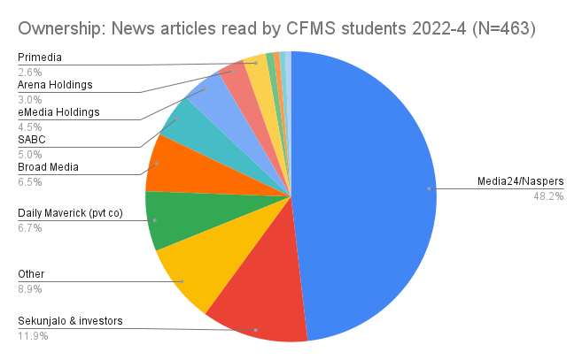
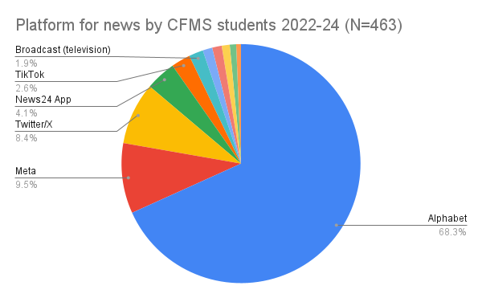

# Media and society
{: .no_toc }
*By Marion Walton & Wallace Chuma, University of Cape Town*

Media reflect and shape power relations in societies in many ways. 

In this part of the course, we'll investigate the social, political, cultural and economic role of the media, and especially of the mass media and social media, in different contexts around the world. 

## News media

**News media** are tightly intertwined with political and economic power. 

News media can function as the **mouthpieces of the powerful**. For example, in South African history, both the SABC as state broadcaster, and commercial print media organisations such as Nasionale Pers (now Naspers) operated under stringent state censorship and played active roles articulating racist ideologies and perpetuating the  social system of apartheid (<a href="references.html#wasserman_2009">Wasserman, 2009</a>) while English and Afrikaans, as colonial languages, dominated the media industries.

 News media can also potentially play important roles in **democracies**, particularly when they are used to inform the public at large.  In the post-apartheid era, the SABC in its new role as public broadcaster is mandated to provide programming in **all official languages**, including sign language, 
 
In addition, news organisations can also articulate public grievances and hold power to account with **investigative journalism**. 

As a result news media enjoy special protections in post-apartheid South Africa, where they are considered essential to freedom of expression. Despite this important role in a democratic system, in many ways news organisations uphold the **economic and political interests** of the powerful.  
 
For example, in the post-apartheid era, the ANC as governing party has appointed officials to key roles in the broadcaster, and the SABC has continued to give positive coverage to the ANC-led government and party (<a href="references.html#mpofu_2020">Mpofu, 2020</a>).

While tight control of media and state propaganda is often discussed in relation to authoritarian societies, scholars in the **political economy** tradition have documented how mass media also play a propagandistic role that reinforces political, economic and class privileges in capitalist societies (<a href="references.html#herman_1988">Herman & Chomsky, 1988</a>). This is because business models for news media are driven by advertising sales or subscriptions, which means that they are dependent on commercial support and often cater to wealthier readers and viewers who can afford to pay subscriptions and have more buying power. 

## Ownership 
We are surrounded by many different sources of information and media titles. Nonetheless, the media
industries which produce most of the media we consume and the social media platforms where we stay in touch with other people are owned by a handful of huge companies. We refer to this as  **highly concentrated** ownership.  

 Such media organisations respond to the political and economic interests of their owners by producing a steady flow of images, stories and information which reproduce the structure of class inequalities and imbalanced power relations that benefit the dominant class (<a href="references.html#harper_nd">Uzuegbunam</a>, 2020). 

Overlapping relationships of economic and media power are also found in African countries, albeit subject to some important differences, such as the limited reach and influence of media on the continent (<a href="references.html#chuma_2019">Chuma</a>, 2019).  

## Globalisation

Globally, concentrated media ownership has meant the cultural dominance of Western organisations and of the US in particular. The idea of **[cultural imperialism](definitions.html#cultural_imperialism)** describes the one-directional flow of media and cultural content in the context of a broadly Western power over the rest of the world (<a href="references.html#schiller_2020"> Schiller, 1976</a>). Because of the historical power of the USA, this perspective on globalisation has often focused on how the USA has dominated cultural industries globally, with Hollywood, and other programming, advertising and consumer culture influencing that of the rest of the world.

Given an overall context of US dominance, it's important to remember that global streams of ideas, stories and images flow in **many directions**. For example, Bollywood and the film industry in India now entertain millions of viewers globally (<a href="references.html#mishra_2020"> Mishra, 2020</a>). In 2007, Nollywood, or the Nigerian movie industry, overtook Hollywood, becoming the second-largest movie producer in the world (<a href="references.html#agbese_2020">Agbese, 2020</a>).

## Consumer culture
Advertising media, marketing and branding play a key role in contemporary society. These media industries work hard to tell people what they "need", and what it means when they buy, have, or use certain products. This is known as consumer culture, which is shaped by globalised industries and media as well as  how people make sense of the world in local cultural contexts (<a href="references.html#kurultay_2020"> Kurultay, 2020 </a>).

Around the world, people's values, meanings, and identities develop as they engage in activities associated with consuming goods and services. Despite the cultural power of big brands, marketers are not always successful, and need to pay careful attention to how people people often reject or challenge commercial messaging as they negotiate meanings for themselves and work independently to change their societies (<a href="references.html#kurultay_2020"> Kurultay, 2020 </a>). While the same "global" products are marketed in very different contexts around the world, brand messaging is carefully **localised**, and people respond to this messaging in many ways, and use or **appropriate** brands to for their own purposes.

### News media ownership in South Africa

We are surrounded by many different sources of information and media titles. Nonetheless, the ownership of the media
companies which produce most of the media we consume and the social media platforms where we stay in touch with other people
is **highly concentrated**.

For example, South African news media is dominated by "the big four", or the four commercial media companies (Naspers/Media24, Sekunjalo/Independent, Arena Holdings and Caxton) 
which together produce most of the news South Africans encounter every day. **Naspers (via Media24)** owns the biggest online news platform (News24) as well as many other publications in South Africa. 

### "Big tech" and news in South Africa

While media organisations monopolise news production, people increasingly get their news and entertainment via social media, search engines and chatbots, which threatens the revenue model of traditional media (<a href="references.html#competition_2025"> Competition Commission, South Africa. 2025 </a>). 

Ownership of **technology and social media platforms** is also highly concentrated. As a result, most of the news we encounter is likely to be found on a few massive websites or apps. Youtube, Google search and the Chrome browser are all owned by **Alphabet**, while Facebook, Instagram and Whatsapp are all owned by **Meta**.  The growing power of these platforms is why they are referred to informally as "Big tech". 

### Who owns your news?

Figure 3 reports on a survey (conducted from 2022 to 2024) where CFMS students were asked to share a news article 
or broadcast which they had encountered on that day. 

If you're anything like the participants in this survey, most of the news you encounter was probably published by Naspers.

<figure>

  
<figcaption>Figure 3: Ownership of news sources used by UCT Media students 2022-2024. - <a href="https://docs.google.com/forms/d/e/1FAIpQLSebxkmLn52uxCCkGtBplAGJ2Lf2MsBxJXHv2-tzUJktDPAp4g/viewform">Class survey</a></figcaption>
</figure>

As Figure 4 shows, the CFMS students who participated in the survey mostly encountered news via
Alphabet's search engine (Google), browser (Chrome), or video hosting site (Youtube).

<figure>

  
<figcaption>Figure 4: News platforms used by UCT Media students 2022-2024. - <a href="https://docs.google.com/forms/d/e/1FAIpQLSebxkmLn52uxCCkGtBplAGJ2Lf2MsBxJXHv2-tzUJktDPAp4g/viewform">Class survey</a></figcaption>
</figure>

 
Now it's your turn to take the survey and see who owns **your** news?

<iframe src="https://docs.google.com/forms/d/e/1FAIpQLSebxkmLn52uxCCkGtBplAGJ2Lf2MsBxJXHv2-tzUJktDPAp4g/viewform?embedded=true" width="640" height="2027" frameborder="0" marginheight="0" marginwidth="0">Loading…</iframe>

