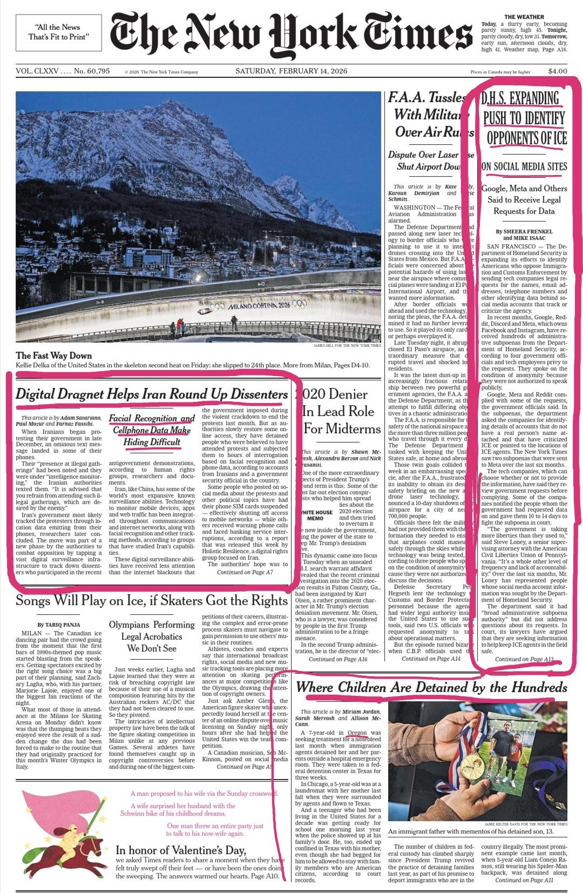

# Powerful Owners - mass media
{: .no_toc }

Media organisations are often created as a result of **monopolistic** strategies to consolidate their economic power, 
and then purchased by wealthy individuals, who can use them to promote their own financial and ideological interests.

- TOC
{:toc}

Wealthy individual media owners such as Rupert Murdoch (News Corp) or Jeff Bezos (*The Washington Post*, Amazon) have used their media holdings to exert considerable political and economic power around the globe.

<figure>

<figcaption>Figure 1: Rupert Murdoch in 2012 Credit - <a href="https://upload.wikimedia.org/wikipedia/commons/thumb/c/c8/Rupert_Murdoch_-_Flickr_-_Eva_Rinaldi_Celebrity_and_Live_Music_Photographer.jpg/440px-Rupert_Murdoch_-_Flickr_-_Eva_Rinaldi_Celebrity_and_Live_Music_Photographer.jpg">Wikimedia</a></figcaption>
</figure>

South African billionaire Koos Bekker, former CEO of South African media giant, Naspers, was mentioned at the inquiry into State Capture
as having influenced South Africa's transition to digital television in a way which would favour Multichoice, which was then owned by Naspers. Bekker, while not an individual owner, had considerable shareholding in the organisation.

<figure><figcaption><a href="https://www.facebook.com/photo.php?fbid=10155609687563580&id=26065833579&set=a.10151001929983580">Credit:Zapiro</a></figcaption></figure>

Iqbal  Survé, owner of Independent Media, frequently appears on the front page of his own publications which also provide supportive coverage of his other business holdings through Sekunjalo Investments. News24 lodged a complaint with the Press Council in 2024 complaining that Independent Media had invented fictitious personae who were given bylines as fake authors of "op eds" attacking the individual journalists who had reported critically on Survé's business holdings ([Wilson et al., 2024](/ideas/references/index.html#references)). 

### Powerful owners - social media

Much as with traditional media, social media platforms are also used by their owners, which include U.S. billionaires such as Mark Zuckerberg or Elon Musk to advance their own commercial and political interests, and to influence which kinds of messages are viewed by their users. 

This conflation of power, wealth, and patriarchy have led to these billionaire owners being referred to as the "broligarchy". Mark Zuckerberg, Lauren Sanchez, Jeff Bezos, Sundar Pichai and Elon Musk were seated together at  <a href ="https://www.gettyimages.com/detail/news-photo/of-meta-mark-zuckerberg-lauren-sanchez-us-businessman-jeff-news-photo/2194353829">Donald Trump's inauguration</a> in 2024, creating an iconic image of the close relationship between big tech and economic and political power in the USA.  

TikTok followed Meta and Microsoft into the fold when the US applied pressure for TikTok to be sold by Bytedance to a group of US investors, among them business software giant Oracle.  Larry Ellison, another billionaire, and founder of Oracle also has substantial media holdings in the US. 

Although these right wing billionaires champion free speech, their grip on both traditional and online media gives them considerable individual power to steer the news and censor or render invisible the ideas they don't like. For example, in the runup to the 2024 election, Jeff Bezos, is known to have intervened to stop the publication of a *Washington Post* editorial in support of Democratic presidential candidate Kamala Harris. 

In another obvious display of power, billionaire Elon Musk bought social media platform Twitter, renamed it "X", and used it to help Donald Trump to win the 2024 US election, gaining the power to promote his ideologies in the new administration as well as on his social media platform. 

<figure>

<figcaption>Figure 3: Elon Musk at Trump's 2025 inauguration. Credit - <a href="https://upload.wikimedia.org/wikipedia/en/e/ea/Elon_Musk_gesture.gif">Wikimedia</a></caption>
</figure>

After TIkTok changed ownership, many users planned to leave the platform because they felt that their content critical of the US government was being made less visible or "shadowbanned". 

Others were concerned that the right wing owners would share social media user data with government departments which wanted to crack down on critics on social platforms.

At Meta, a platfom which had banned Donald Trump in 2020, the shift in power after the 2025 inauguration of Trump, was followed by dramatic changes in moderation
policies on the platforms, as parodied by US comedian, John Oliver:

<iframe width="560" height="315" src="https://www.youtube.com/embed/nf7XHR3EVHo?si=GVp2ZaV5h-UUKPJV" title="YouTube video player" frameborder="0" allow="accelerometer; autoplay; clipboard-write; encrypted-media; gyroscope; picture-in-picture; web-share" referrerpolicy="strict-origin-when-cross-origin" allowfullscreen></iframe>
