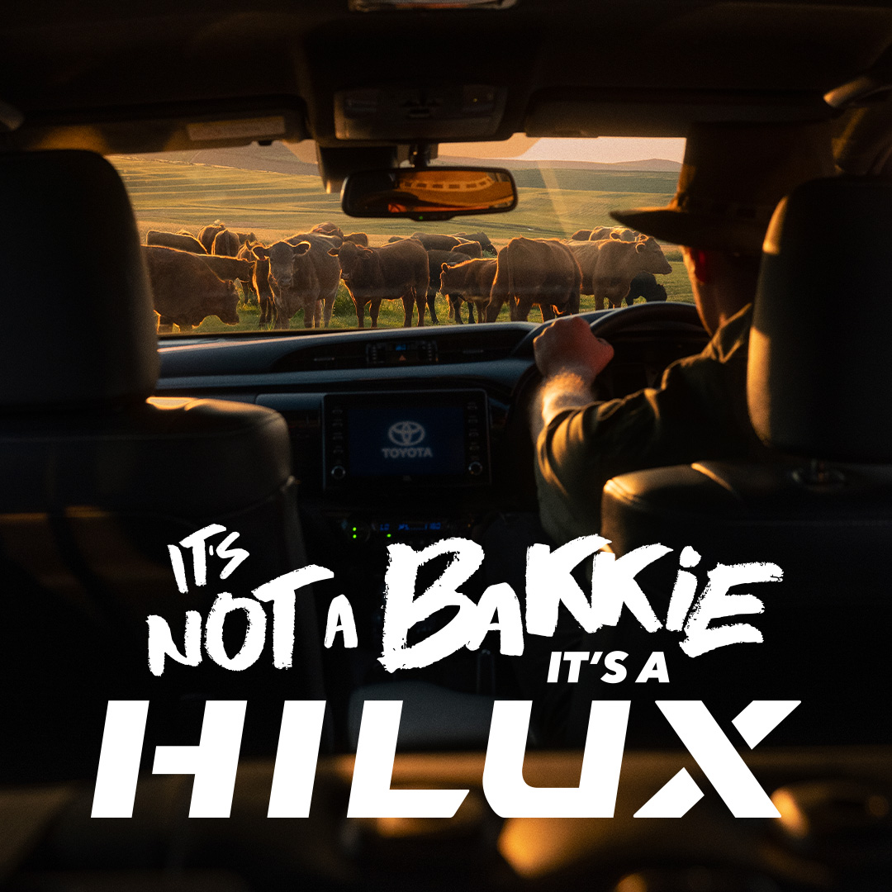

# Case study - Fossil fuels
{: .no_toc }
*By Marion Walton, University of Cape Town*

### Case studies
 
What strategies do these television ads use to gain attention? What audiences do you think they were targeting and why?

**Case study \- [Example 1 \- Toyota “It’s a not a bakkie, it’s a Hilux](https://www.youtube.com/watch?v=iZKEvtA74ac)”**

<figure>
<iframe width="560" height="auto" src="https://www.youtube.com/embed/iZKEvtA74ac?si=HxIEN5xOc6jlQtV4" title="YouTube video player" frameborder="0" allow="accelerometer; autoplay; clipboard-write; encrypted-media; gyroscope; picture-in-picture; web-share" referrerpolicy="strict-origin-when-cross-origin" allowfullscreen></iframe>  
</figure>
<figcaption>Example 1 \- TV Spot - Toyota “It’s a not a bakkie, it’s a Hilux</figcaption>

<figure>
  </iframe>
<figcaption>Example 2 \- Toyota Hilux Youtube thumbnail</figcaption>
</figure>

<figure>
  </iframe>
<figcaption>Example 2 \- Toyota Hilux Still for [RiseFM radio campaign](https://risefm.co.za/its-not-a-bakkie-its-a-hilux/)</figcaption>
</figure>

Toyota SA commented on the multilingual aspects of the campaign.
"We are also excited to launch some of the campaign elements not only in English, but also in isiZulu, isiXhosa, Sepedi and Afrikaans.” 

<figure>
  <blockquote class="tiktok-embed" cite="https://www.tiktok.com/@bobbypetkov1/video/7432560360462224646" data-video-id="7432560360462224646" style="max-width: 605px;min-width: 325px;" > <section> <a target="_blank" title="@bobbypetkov1" href="https://www.tiktok.com/@bobbypetkov1?refer=embed">@bobbypetkov1</a> 
The Bakkie with a LEGENDARY status, the one and only... Toyota Hilux!!! #toyota #hilux #toyotahilux #toyotahiluxclub #legend #toyotaholics #toyotaholicsafrica #carreview #richelieu #bfgoodrich #toughguy #hiluxadventures #mitmakmotors #bobbypetkov #staypowerful
 <a target="_blank" title="♬ original sound  - Bobby Petkov" href="https://www.tiktok.com/music/original-sound-Bobby-Petkov-7432560391509936901?refer=embed">♬ original sound  - Bobby Petkov</a> </section> </blockquote>   <figcaption>Example 2 \- Toyota Hilux Influencer TikTok</figcaption>
</figure>

**Case study \- [Example 2 \- VW “#DoItBig with AutoTrader in 2025"](https://www.youtube.com/watch?v=nUtd-pG6nl0&t=1s)”**

<figure>
<iframe width="560" height="315" src="https://www.youtube.com/embed/ln8re69f8Hw?si=_YcNyu6p_ag101yg" title="YouTube video player" frameborder="0" allow="accelerometer; autoplay; clipboard-write; encrypted-media; gyroscope; picture-in-picture; web-share" referrerpolicy="strict-origin-when-cross-origin" allowfullscreen></iframe>
<figcaption>Example 2 \- #DoItBig with AutoTrader in 2025!</figcaption>

</figure>

**Case study \- [Example 3 \- VW “German tech meets Mzansi craftsmanship #GottaGetAVivo](https://www.youtube.com/watch?v=nUtd-pG6nl0&t=1s)”**

<figure>
<iframe width="560" height="auto" src="https://www.youtube.com/embed/nUtd-pG6nl0?si=Ibe1RTIWrIKxvQmf" title="YouTube video player" frameborder="0" allow="accelerometer; autoplay; clipboard-write; encrypted-media; gyroscope; picture-in-picture; web-share" referrerpolicy="strict-origin-when-cross-origin" allowfullscreen></iframe>
<figcaption>Example 3 \- VW “German tech meets Mzansi craftsmanship #GottaGetAVivo</figcaption>
</figure>

<figure>
  </iframe>
<figcaption>Example 3 \- VW Vivo Youtube thumbnail</figcaption>
</figure>

### Influencers
 
What strategies do these influencer posts use to gain attention? What audiences do you think they were targeting and why?

**[Case study Influencer marketing #shouldagotavivo](https://www.tiktok.com/@volkswagensouthafrica/video/7379928341823900934)**

<blockquote class="tiktok-embed" cite="https://www.tiktok.com/@volkswagensouthafrica/video/7379928341823900934" data-video-id="7379928341823900934" style="max-width: 605px;min-width: 325px;" > <section> <a target="_blank" title="@volkswagensouthafrica" href="https://www.tiktok.com/@volkswagensouthafrica?refer=embed">@volkswagensouthafrica</a> If @agirlnamedcassidy gives you a scoop – you sit up, laugh your head off and then pay attention! 🤣😐 It would really help you to do so now, especially since you have less than 24 hours to enter our <a title="shouldagotavivo" target="_blank" href="https://www.tiktok.com/tag/shouldagotavivo?refer=embed">#ShouldaGotAVivo</a> competition and stand a chance of winning a brand-new Polo Vivo*. <a title="polovivo" target="_blank" href="https://www.tiktok.com/tag/polovivo?refer=embed">#PoloVivo</a><a title="volkswagen" target="_blank" href="https://www.tiktok.com/tag/volkswagen?refer=embed">#Volkswagen</a> <a title="competition" target="_blank" href="https://www.tiktok.com/tag/competition?refer=embed">#competition</a> <a title="cartok" target="_blank" href="https://www.tiktok.com/tag/cartok?refer=embed">#cartok</a> <a title="carlover" target="_blank" href="https://www.tiktok.com/tag/carlover?refer=embed">#carlover</a> <a target="_blank" title="♬ original sound  - volkswagensouthafrica" href="https://www.tiktok.com/music/original-sound-volkswagensouthafrica-7379929400094919429?refer=embed">♬ original sound  - volkswagensouthafrica</a> </section> </blockquote> 

