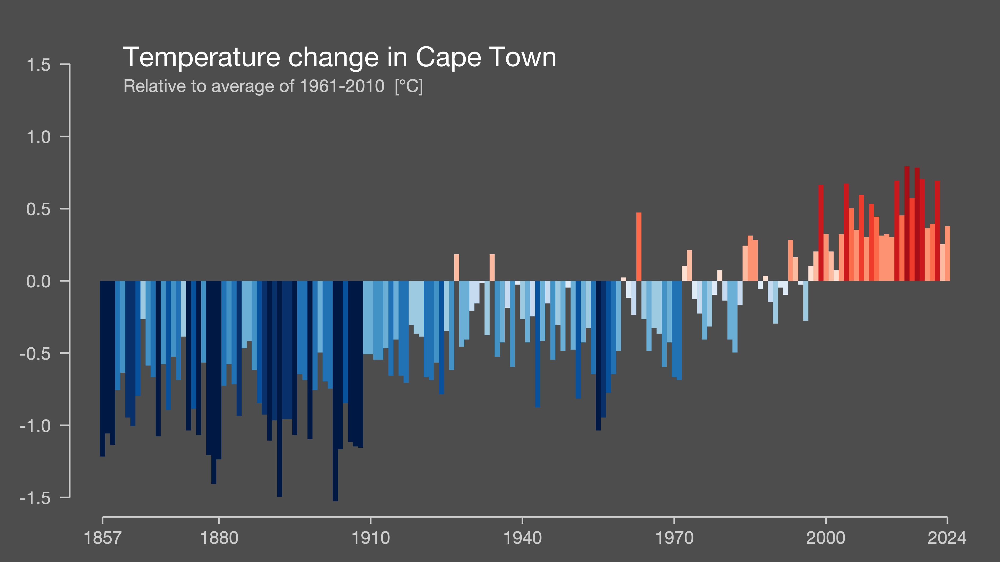
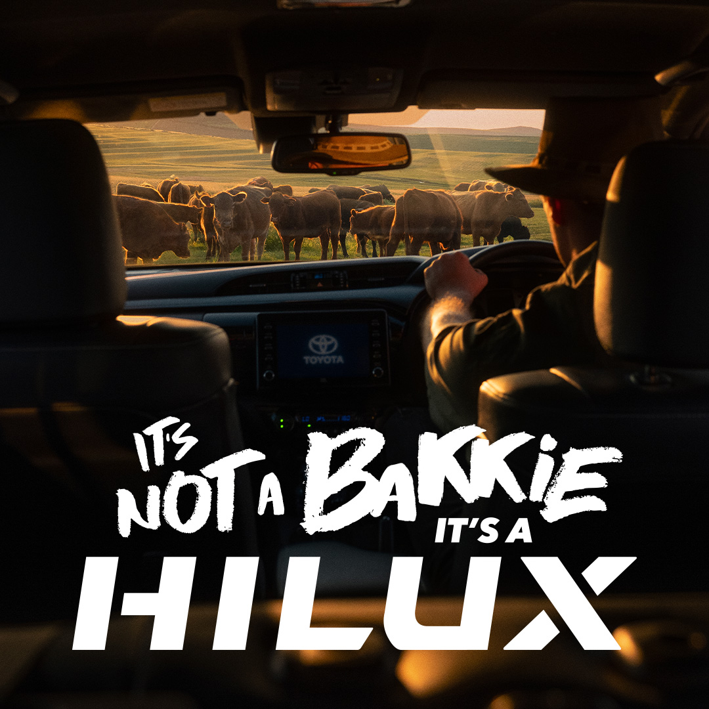
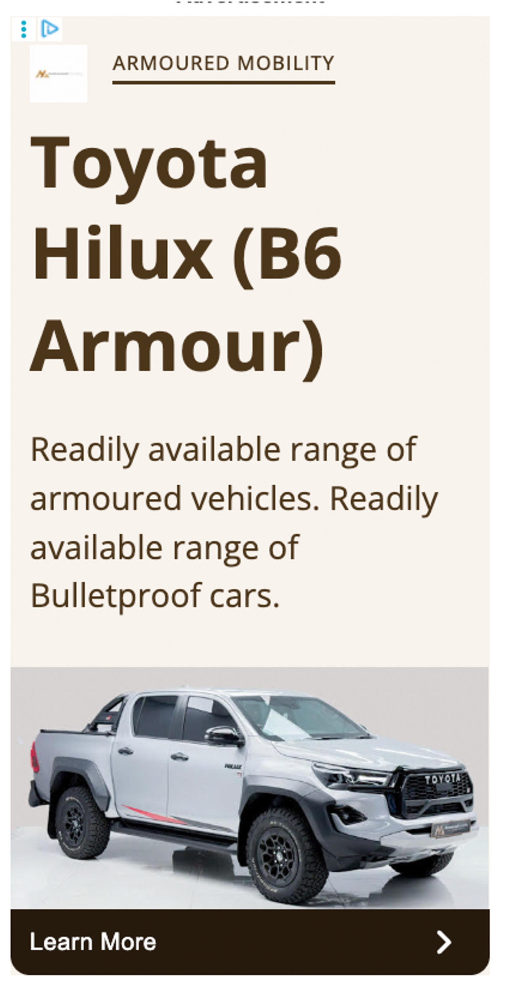

# Examples - Fossil fuels
{: .no_toc }
*By Marion Walton, University of Cape Town*

Dramatic changes to the earth's climate are directly linked to the explosion in human consumption of fossil fuels such as petrol, coal and gas, which produce greenhouse gases such as carbon dioxide and methane. Our use of fossil fuels has increased rapidly since the industrial revolution, and as a result of the greenhouse effect in the earth's atmosphere, is leading to steadily rising average global temperatures. 

Figure 1: Temperature change in Cape Town. Credit - [Showyourstripes](https://showyourstripes.info/c/africa/southafrica/capetown)
These environmental disruptions are currently causing extreme weather events like storms, floods and droughts, with serious consequences especially in countries like South Africa. 

We know that continued consumption of fossil fuels will threaten everyone's future, and yet companies continue to market and advertise environmentally harmful products such as fossil fuels (e.g. petrol and gas) and related products like cars, which release carbon dioxide and methane into the atmosphere. The manufacture of electricity from coal and producing plastics and AI chatbots also generates large quantities of fossil fuels. 

The billions spent on marketing and advertising such products encourages people to consume more fossil fuels. Campaigns also often use greenwashing techniques to confuse people about the known causes and remedies for the climate emergency. 

For this reason, cities like Amsterdam have already banned fossil fuel advertising in public places.  (They also ban red meat advertising since cows produce a lot of methane.)

In this case study, we'll look at marketing and advertising strategies used by some South African car brands and discuss how they engage with consumer culture to encourage continued consumption of fossil fuels.

## Case studies
### Television: It's not a bakkie
 
What strategies does this ad use to gain attention? What associations does Toyota want to create with cars and driving? What audiences do you think they were targeting and why?

**Case study \- [Example 1 \- Toyota “It’s a not a bakkie, it’s a Hilux](https://www.youtube.com/watch?v=iZKEvtA74ac)”**
<iframe width="560" height="315" src="https://www.youtube.com/embed/iZKEvtA74ac?si=lpfCqI2TKlPPa3vL" title="YouTube video player" frameborder="0" allow="accelerometer; autoplay; clipboard-write; encrypted-media; gyroscope; picture-in-picture; web-share" referrerpolicy="strict-origin-when-cross-origin" allowfullscreen></iframe>

Example 1 - TV Spot - Toyota “It’s a not a bakkie, it’s a Hilux" -broadcast version (English) via [YouTube](https://www.youtube.com/watch?v=iZKEvtA74ac)

On their [website](https://www.toyota.co.za/connect/article/its-not-a-bakkie-its-a-hilux), Toyota SA commented on the campaign.
"It was important that the family felt real and that they spoke both English and Afrikaans (campaign elements launched in both languages, as well as in isiZulu, isiXhosa and Sepedi), explains Clayton. A hardworking oupa with a soft spot for his grandson, a relatable ouma and a city-dwelling daughter visiting her parents with her son on his birthday make up the family. The biggest challenge was casting the grandson. ‘Many kids auditioned, but this little guy’s performance was just so believable. The moment we saw him, we knew we had the right one.’” 

### Digital advertising

Example 2: Single frame digital ad

### Targeted advertising

Targeted Google Ad for armoured Toyota Hilux, placed on news website.

## Influencer campaign - VW #ShouldaGottaVivo
 
What strategies does this influencer post use to gain attention? Which audiences do you think Volkswagen was targeting by sponsoring this influencer? Why?

**[Case study Influencer marketing #shouldagotavivo](https://www.tiktok.com/@volkswagensouthafrica/video/7379928341823900934)**

<blockquote class="tiktok-embed" cite="https://www.tiktok.com/@volkswagensouthafrica/video/7379928341823900934" data-video-id="7379928341823900934" style="max-width: 605px;min-width: 325px;" > <section> <a target="_blank" title="@volkswagensouthafrica" href="https://www.tiktok.com/@volkswagensouthafrica?refer=embed">@volkswagensouthafrica</a> If @agirlnamedcassidy gives you a scoop – you sit up, laugh your head off and then pay attention! 🤣😐 It would really help you to do so now, especially since you have less than 24 hours to enter our <a title="shouldagotavivo" target="_blank" href="https://www.tiktok.com/tag/shouldagotavivo?refer=embed">#ShouldaGotAVivo</a> competition and stand a chance of winning a brand-new Polo Vivo*. <a title="polovivo" target="_blank" href="https://www.tiktok.com/tag/polovivo?refer=embed">#PoloVivo</a><a title="volkswagen" target="_blank" href="https://www.tiktok.com/tag/volkswagen?refer=embed">#Volkswagen</a> <a title="competition" target="_blank" href="https://www.tiktok.com/tag/competition?refer=embed">#competition</a> <a title="cartok" target="_blank" href="https://www.tiktok.com/tag/cartok?refer=embed">#cartok</a> <a title="carlover" target="_blank" href="https://www.tiktok.com/tag/carlover?refer=embed">#carlover</a> <a target="_blank" title="♬ original sound  - volkswagensouthafrica" href="https://www.tiktok.com/music/original-sound-volkswagensouthafrica-7379929400094919429?refer=embed">♬ original sound  - volkswagensouthafrica</a> </section> </blockquote> 

