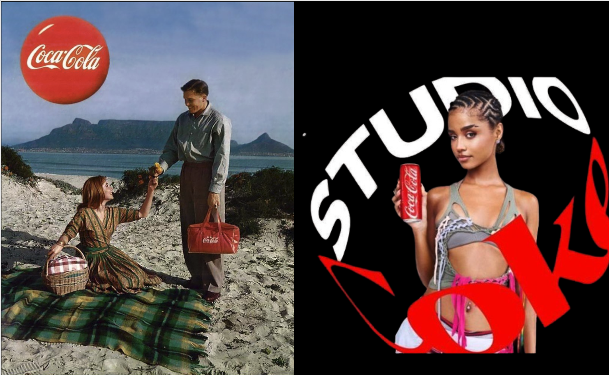

# Gender & Representation
{: .no_toc }

*By Marion Walton & Martha Evans, University of Cape Town*

- TOC
{:toc}

# Gender and representation

Marion Walton and Martha Evans

The goal of this chapter is to understand and challenge **[hegemonic](definitions/hegemony)** models of **sex** and **gender** in the media. We’ll explore the role of gender binaries in everyday language, the visual languages associated with objectification, stereotypes, gender display in advertising and marketing, and gender performativity, and finally ask how and to what extent GenerativeAI is perpetuating existing gender biases. 

As discussed earlier, by "gendered discourse" we mean a range of **practices** which produce categories such as "men", "women" and the relations between them. This includes visual and verbal discourse, as well as how discourse is regulated by social institutions such as advertising and marketing, heteronormative families, single-sex schools, separate sporting codes for men and women, medicine, and so on. These **[multimodal](definitions.html#multimodal)** discursive practices work together with structural racism and other social systems to produce and police subject positions in **intersectional** ways.

We will consider several examples of gender in the media, noticing repeated patterns in **[normative](definitions.html#normativity)** media representations of masculinity and femininity, and in particular the **[binary oppositions](definitions.html#binary-oppositions)** between them. These examples will show how the semiotic details of visual representations such as photographs, advertising and synthetic media are used to construct **gendered identities** and **[ ideologies](definitions.html#ideology)** that may support or challenge **patriarchal social structures**. 

[Discourse](definitions.html#discourse-(foucault)){: .btn .btn-blue }
[Post-structuralist](definitions.html#post-structuralist){: .btn .btn-blue }
[Intersectionality](definitions.html#intersectionality){: .btn .btn-blue }
[Binary oppositions](definitions.html#binary-oppositions){: .btn .btn-blue }

## Gender

Gender refers to “social and cultural roles, personality traits, and behaviours that are deemed **socially acceptable for men and women** in relation to concepts of masculinity and femininity” ([O’Shaughnessy,  Stadler, & Casey, 2016:360](references.html#oshaughnessy_2016)). 

{: .example}

Figure 1 Coca-Cola Advertisement circa 1956. Coca-Cola South Africa Facebook Campaign featuring Tyla in Coke Studio promotion, 2024. | 
The meanings we associate with femininity have changed over time, as illustrated by  the two Coca-Cola ads. What do they show us about how hegemonic femininities have changed in South Africa since 1956? How do we interpret these identities today? What social changes and governing institutions may have given rise to the change in significations?

The term “gender” was introduced by anthropologist Margaret Mead ([Delphy, 1993](references.html$delphy_1993)) who observed that gender role expectations and the temperaments of men and women in indigenous societies were starkly different to those in the United States at the time.   

 People's understanding of gender changes over time and differs between cultural contexts, as illustrated by the different versions of femininity in the Coca-Cola ads in Figure 1. 

Decolonial scholars show how gender ideologies and discourses emerge in specific contexts. For example, Oyewumi ([1997](references.html#oyewumi)) argues against imposing Western gender theories (and even the category “woman”) when discussing pre-colonial African societies, noting how scholars interpreted the history of Yoruba society through a patriarchal lens, assuming that leaders were men, while in fact Yoruba women lost many property rights and other powers as a result of colonial rule. 

{: .question}
What terms are used to discuss cultural aspects of our gender identities (rather than biological sex)?

Answer

Terms for gender identity include, but are not limited to, woman, man, non-binary, genderqueer, and agender.” ([LGBTQ GLOSSARY](https://web.archive.org/web/20230519035630/https://studentaffairs.jhu.edu/lgbtq/education/glossary/)) 

{: .activity}
How does the meaning of “man” and “woman” differ in different contexts and different historical periods (e.g. colonial and precolonial)? 

## Binary oppositions

Binary is a mathematical term which describes a numeral system with only two different **symbols** (1 or 0). In language, binary oppositions are a system of opposing and mutually exclusive categories or signifiers. 

| More power | Less power |
|------------|------------|
| Man        | Woman      |
| Rational   | Emotional  |
| Straight   | Gay        |

 These binary oppositions underpin **hegemonic** social hierarchies (e.g. in many contexts “man” has more social power than “woman”, “straight” has more social power than “gay”, “logic” has more social power than “emotion”). 
 
Understanding these binary oppositions in patriarchal discourses can help us to explain many gender **stereotypes**.  

Furthermore, binary categories work together when people try to enforce normative identities. For example, women are expected to be more caring than men, while also being judged for being overly emotional. Because the categories are seen as mutually exclusive, some people find the idea of gender transition a challenging concept. Similarly, when women have physical traits such as muscular shoulders or facial and body hair, this is often enough for people to question their femininity or even their identity as women..

The pressures of binary stereotypes, and the lack of space for non-normative identities is pronounced in languages like English where even personal pronouns specify gender (“he” vs “she”). This is one of the reasons that some people prefer to use gender-neutral pronouns (“they, them”).

## Women and men

When discussing the cultural dimensions of gender, avoid the biological terms “male” and “female”, as well as terms which are loaded with gendered assumptions (e.g. “lady”). Instead, use “women” and “men” which refer to people’s **gender identity**. 

It's important to be aware though, that these terms are often used interchangeably with the biological terms “male” and “female” to construct a **gender binary**. A man/woman opposition is a major organising principle of social and media institutions such as sports and schools, where they are equated with biological terms “male” and “female”.  Used in this binary way, the terms exclude other possible identities, such as trans people who transition from one gender identity to another, as well as the identities of people who identify as **non-binary.** 

Used inclusively, with an awareness of **[intersectionality](definitions.html#intersectionality)** the terms “women” and “men” provide politically useful ways to challenge **sexism and misogyny**, and to encompass critiques of **cis normativity** and **gender binaries**. 

## Sex and/or gender?

​​Feminists have traditionally distinguished between the terms “sex” (used to discuss biological issues) and “gender” (referring to culture and signification). For example, Oakley ([1972:6](references.html#oakley_1972)) explains the difference as follows:

    "Sex" is a word that refers to the biological differences between male and female: the visible difference in genitalia, the related difference in procreative function. “Gender” however is a matter of culture: it refers to the social classification into “masculine” and “feminine” 

Nonetheless, many feminists would argue that our understanding of biological sex is also profoundly shaped by cultural beliefs about gender. Butler ([1999](references.html#butler_1999)) argues that it makes no sense to talk about biological “sex” separate from its social meanings to us and also questions essentialist uses of the category "woman". 

Women scientists in particular have highlighted how sexist ideologies have distorted scientists’ perception of sex, reproduction and female animals ([Cooke, 2022:x](references.html#cooke_2022)). Despite claims that “male” and "female” sexes are neatly differentiated, contemporary biological sciences suggest a far more complex picture. There is extensive biological variation in many physical traits, and even the chromosomes associated with “male” and “female” development involve complex activations and downstream effects ([Graves, 2018](references.html#graves_2018)) . 

To add to this complexity, bio-medical technologies such as birth control pills, hormone replacement therapy, gender affirming therapies and even body-altering fashions such as cosmetic surgery and corsets are cultural interventions mediating our physical experience and gender presentation. 

We will use the term gender, since Media Studies focuses on issues of culture and signification, and discussions of gender rather than biology. 

{: .question}
What terms are used to discuss biological aspects of sex (rather than gender)?

Answer

Terms for sex include, but are not limited to "male", "female" and "intersex".” ([LGBTQ GLOSSARY](https://web.archive.org/web/20230519035630/https://studentaffairs.jhu.edu/lgbtq/education/glossary/)) 

## Biological traits and the media

Our experience of living in a human body is mediated culturally through the language and images we use to represent and describe our bodies. While bodies exhibit a wide range of many different variations, language works in simplistic categories (man/woman), and visual media tends to reinscribe these categorical differences. 

For example, while men are more likely to be biologically taller than women, there are some women who are taller than many or even most men. In Hollywood, many women actors are taller than their (male) love interests. These tall women actors tend to be shot in ways which exaggerate the height of the man in relation to the woman. In this and many other ways media industries tend to exaggerate physical gender differences as a part of reinscribing **heteronormativity**.

Beyond exaggerating gender differences, the media can be used to build public understanding of physical diversity. Instead it often amplifies the stigma and harmful vitriol directed at anyone who does not conform to a rigid binary. Think of how the international news media stigmatised Caster Semenya. Although Semenya identifies and was raised as a woman, her testosterone levels were ruled too high for her to compete in women’s categories without medical intervention.

## Gender normativity and the media

Gender normativity involves adhering to or reinforcing hegemonic rules and standards about what kinds of behaviour are allowed for men and women. 

For men, gender normativity is often associated with **hegemonic masculinity**. For women it is linked to the dominant and conventionally “womanly” forms of **femininity**.  These ideals change over time and vary in different contexts. An additional important dimension of gender normativity for both men and women is **heteronormativity**.

### Hegemonic femininity

Idealised hegemonic forms of Western femininity (as elsewhere) are often associated with motherhood. While physical beauty is imperative, women’s active sexuality is potentially threatening, and a common target of **misogyny**. Labels which suggest a woman is sexually active tend to be negative, while the same terms for men often have a positive, congratulatory meaning. 

### Hegemonic masculinity

Hegemonic images of men in the media tend to emphasize power (both physical and economic) and victory, in what has been termed phallic masculinity (Gill, 2010). Representations repeat the association of physical strength, power, muscle, heroism, stamina, and endurance with masculinity. As a result that the abstraction of men’s social power is reified, and often takes a physical shape in  visual media. 

### Heteronormativity

Heteronormativity refers to an ideology about heterosexuality as the "normal" or "natural" form of attraction and relationships. This “natural” configuration of relationships is ideologically defined as a relationship between one man and one woman, who both embody conventional gender roles & norms (hegemonic masculinity and feminity), and engage in conventional sexual practices (Barker, 2016:84). These different normativities are related and are kept in place through the associations between a whole set of binary oppositions  e.g. man vs woman, strong vs weak, dominant vs subordinate, gay vs straight. 

## Gender in advertising

Investigating gendered conventions in advertising encourages us not only to see the world differently, but to imagine how we might do it differently.

### Stereotypes

Feminist discussions of advertising have challenged the sexist **stereotypes** of an earlier era, where women were most often represented and interpellated as mothers, housewives, or sex objects. These critiques played a role in shifting advertising away from earlier scripts where **men’s authoritative voices** recommended products to women who were increasingly important as consumers. 

### Objectification

Feminists also highlighted the prevalence of **objectification** in advertisements exploiting women’s physical appearance for commercial purposes. These advertisements often borrowed a cinematic style where women’s bodies and appearance were depicted primarily as objects of the “male gaze”. Through such visual traditions, while men gained pleasure in viewing, while (white) women were socialised to be passive and accustomed to being viewed (Laura Mulvey, 1975). 

### Oppositional gaze

The positioning for Black women is more complex. For example, bell hooks (1992) recalls her own experience of viewership and cinema. As a young woman, she did not see herself represented on the screen beyond a set of **narrow stereotypes**. Black women were not even represented as visual objects of desire. hooks’s notion of the “**oppositional gaze**” draws our attention to what is not represented, as well as to the experience and dissenting perspective of Black women as viewers  (bell hooks, 1992). 

### Gender Display 

Erving Goffman (1979) studied large numbers of magazine and billboard advertisements and noticed that they depicted everyday social rituals of what he called “gender display” which constructed scenes of what he termed “female subordination”.  In particular, Goffman noted a **ritualised subordination**, where men and women’s roles repeated a version of the child--parent relationship, with women occupying the position of the child. When both men and women appeared together, the women often held on to the man for support (Goffman, 1979: 40). Even when depicted alone, women often assumed postures expressing this subordination with their bodies unbalanced, their knees canted, heads tilted, their throats exposed, or in half-reclining positions emphasizing vulnerability (Goffman, 1979: 40),

Adverts frequently featured what he termed the “**feminine touch**” (Goffman, 1979: 29-31) where women’s fingers and hands touched, cradled or caressed an object, including self-touching the female body as if it was a precious object. He also noticed ‘**licensed withdrawal’**, when women were depicted in a dreamy state, somewhat removed from what was happening around them.

### Commodity feminism

Women's feminist anger at the often exploitative and potentially harmful pressures of the beauty and fashion industries have been commercially appropriated under **neoliberal post-feminism**.   
This took the form of the **commodity feminisms** which took off as ways appropriate the energy and engagement of online activism in fourth wave feminism. Considered “daring” about 20 years ago, campaigns such as Dove’s "Real Beauty" ads claimed to break traditional media stereotypes and to challenge sexism in culture and language. They also allowed advertisers to respond to “sign fatigue” and skepticism about advertising claims and voice women’s anger about hyper-idealised notions of beauty (Gill, 2010). 

Commodity feminist branding campaigns are fast becoming new normativities, following a script written by groundbreaking campaigns such as Dove's. Such campaigns rewrite a very narrow beauty narrative while still selling their products as being essential for women to achieve appropriate levels of (**post-feminist**) self-esteem. This is also known as "**femvertising**".  Examples of these include the Dove, Nike, and L'Oreal "Statements of Worth" campaigns.

Media and cultural studies perspectives emphasize how media and beauty brands have been and still are highly complicit with gendered **normativities** requiring all women and particularly Black women to engage in considerably more **aesthetic labour** than men do, while also spending a large amount of their income on beauty products, often in the guise of "self-care". 

While both visual and verbal languages reflect and perpetuate social inequalities, people are always developing new language and semiotic resources and using them to bring about social change. Your creative project will use still images and draw on gender codes and discourses to appeal to its target market, and so we’ll look in  more detail at how print advertising has traditionally relied on a visual language which often subordinates women (Goffman, 1979). 

### Masculinity in advertising

A **hyper-masculine** form of masculinity dominates many action film narratives, as well as games, and these narratives are also sometimes found in adverts. 

The message here is that masculinity solves problems with physical power, and physical violence in some cases. These dominant representations of masculinity tend to allow men a limited emotional range, which finds approved emotional outlets in sporting contests and rage-fuelled physical conflict. 

Masculinity is also intersectional. Hypermasculine qualities such as physical strength and anger may be depicted as toxic, criminal or threatening when combined with racial and class signifiers.

Visual culture has shifted, and men’s bodies are now often also on display. Influenced by feminist movements, the queer movement, and the need to build new markets, **masculinity is objectified** to a far greater extent than in a previous era. These images are a sign of advertisers cultivating and catering to particularly masculine insecurities.

## Activity

{: .activity}
 Plan your own advertising campaign which draws on gender codes and discourses to appeal to its target market.

## Gender bias and AI

## Gender in marked and unmarked terms

In English, normative gender identities tend to go unmarked, while non-normative gender identities are often explicitly marked, either by the use of a specific gendered term (e.g. in the past “actress” was used for women actors) or by using adjectives (e.g. “woman engineer”, “gay wedding” or “a strong, independent woman”. In such cases, the default or unmarked state (“actor”, “engineer”, "wedding”, "woman") is the normative identity (which usually goes without saying and thus doesn’t need to be stated explicitly e.g. a “\[male\] actor or engineer”, “\[straight\] wedding” or a “\[weak, dependent\] woman”). 

## Activity

{: .activity}
 How can we use visual language to create images that play with, trouble or spark discussions about gender in contemporary society?

## Talking about gender

Since much of the language we use to talk about gender is shaped by the patriarchal and colonial history of the English language, we’ll need to define a **vocabulary** that will help us express how media images play a powerful role in influencing, communicating and changing our identities and beliefs about **sex**, **gender** and **sexuality**.

## Sexism  
{: .definition}
Sexism is the ideology justifying men’s dominance in patriarchal social structures.

## Patriarchal social structures 
{: .definition}
Social systems where most women are dominated by some men, where gender oppression **intersects** with other systems of oppression (race, class, sexuality, disability, age etc). 

We often talk about “patriarchy” in a simplistic way as a single system of male domination, or as if “the patriarchy” is a ruling body of powerful individuals. 

Feminist philosopher Kate Manne ([2017](references.html#manne_2017)) explains that, in patriarchal social structures, most women are dominated by some men and that patriarchal structures also **[intersect](definitions.html#intersectionality)** with other systems of oppression (race, class, sexuality, disability, age etc). Patriarchal social structures are also influenced by structures which promote equality (universal suffrage, free childcare, affirmative action etc.). 

Manne argues that these patriarchal social structures do not only lead to gendered hierarchies of domination but also to men’s expectations and sense of entitlement that they will be positioned as dominant with respect to some woman or women. Consequently, Manne claims, even in situations of nominal equality, men tend to have **entitlements** and women tend to have **obligations**. 

## Intersectionality

{:.definition}
The idea that people experience discrimination differently based on their overlapping identities.

Legal scholar Kimberle Crenshaw coined the term “intersectionality” when she saw how affirmative action policies  in the United States assisted white women, or African American men, but were not helpful to African American women, who experienced an intersection of oppression as a result of not just their gender or their race, but their race together with their gender ([Crenshaw, 1991](references.html#crenshaw_1991)).

Humans never exist as only a gender, we always have other intersectional identities. Think about how race, language, age, class, and religion all  change the way others perceive our gender identity.

## Misogyny 

{: .definition}
Misogyny enforces patriarchal social structures by punishing women (in particular) when they deviate from sexist norms ([Manne, 2017](references.html#manne)). 

Misogyny as policing can often be seen in the language we use to describe people. For example, in languages such as English, certain derogatory words are used to construct and simultaneously stigmatise gendered identities, e.g. “bitch” (when a woman is disliked in any way, often because she does not conform to some gendered obligation) or "slut", when she is sexually active. 

In the case of slurs for men, such as “sissy” or “pussy” (when a man is not seen to be suitably masculine) men’s perceived inadequacies in masculinity are punished by the use of feminising slurs or labels. In this way, homophobia and misogyny are often linked.

## Misogynoir  
{: .definition}
Misogynoir is a term for racism combined with misogyny directed towards Black women in particular. 

## Cisgender  
{: .definition}
Cisgender is a term for individuals whose gender identity generally matches with their assigned sex, and who express a normative gender identity outwardly in terms of clothing, hair, and tone of voice.

## Cis normativity
{: .definition}
Cis normativity refers to the assumption that everyone identifies as the gender they were assigned at birth. 

Cis normativity ignores and stigmatises transgender people, who do not identify with the gender they were originally assigned, or who do not identify with only one gender . 

## Queer theory and post-structuralism
A **post-structuralist** approach to gender known as **queer theory** builds on and critiques the **structuralist** ideas we encountered when we studied **semiotics**. According to De Saussure (a structuralist), language is **a system of differences** where signifiers gain meaning in relation to other signifiers. From this perspective, the relationship between the signifier “woman” and what it signifies is conventional and "arbitrary". From this perspective, to understand the meaning of this signifier we need to understand how the word "woman" differs from other signifiers (e.g. “man”). 

Post-structuralists point out that such relationships between signifiers are not fixed but **shift and change**.  In particular, signification changes over time, as illustrated in Figure 1. 

 [Foucault (1980:132)](references.html#foucault_1980) argues that what counts as “truth” is mostly governed (though not exclusively so) by socially dominant institutions. For example, while same-sex sexual practices have existed throughout history, Foucault details how the category "homosexual" only came into being in the 19th century when the medical institutions and practices of the time started documenting a phenomenon they were starting to label as "homosexuality".  

Post-structuralist ideas have also been influential in media studies which investigate how gender normativities are reinforced and challenged through **performative** signifying practices. From the perspective of queer theory, gendered discourse & performativity are “regulatory practices within which bodily contours are constructed" [(Butler, 1999:181)(references.html#butler_1999)]. In other words, powerful social institutions make many of the rules and regulatory practices by which we learn to "do" gender in our bodies, and they also police our bodies when we don't conform. As the idea of non-conformity suggests, we can also counter this power, since our bodies are signs that we can control, vary, and change.

## Queer
{: .definition}
The term “queer” is a reclaimed homophobic insult, which now encompasses a wide range of identities. Queer identities refuse heterosexuality as the standard for all sexualities. 

Queer is also used as a verb. Rather than “queer” describing something people are, from this perspective “queer” is something that people do (especially by parodying gender and calling into question gendered identities) ([
Barker, 2016](references.html#barker_2016)).

## Queer theory
{: .definition}
Queer theory is used to challenge essentialism, break down oversimplifying **binaries**, and to question **heteronormative** identities, categories, and assumptions through the argument that gender norms are performative signifying practices.

By showing how sexuality may be shaped by race and gender in many ways, queer theory exposes how sexual and gender identities are socially constructed. (For more see Baker).

## Gender performativity
{: .definition}
The idea of gender performativity rests on the concept that we learn to “do” gender every day by imitating examples around us, and that gendered discourse is performative in that it works to create and define gender categories. 

	“Gender is a kind of imitation for which there is no original” (Butler, 1999, 722). 

In this way we can think of our bodies as a signifying practice or medium as well as an embodied biological existence. The way we “do” gender can change, but other people will still be reading our identities within the current system. 

By gender performativity, Butler does not mean that gender is something that can be simply "put on" as an actor might put on a wig or hat. Gender is a performance but performativity also works like performatives in language (e.g. "I pronounce you man and wife"), in other words, naming someone a girl or boy works to create them as such ([Szorenyi, 2022](references.html#szorenyi_2022)).

 through the process of repeatedly observing and using particular gendered words, actions, and attitudes, we are constructed as gendered human beings. (For more see Baker)

## Embodied signifying practices

Can we think of our bodies as a medium? **Gender performativity** is one way of explaining how, on the one hand, signs construct and police bodies, and, on the other, how our bodies are also signs that we can control, vary, and challenge. Our **embodied signifying practices** include gendered discourse about bodies & **gender performativity**. In other words, our signifying practices create legible bodies: “a social space for and of the body within certain regulatory grids of intelligibility” ([Butler, 1999:178](references.html#butler_1999)). 

