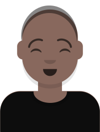

# Media & Society

This pocket textbook focuses on the use of media in **African contexts** and emphasises insights from **cultural studies** and **social semiotics**.

## What is a pocket textbook?
This is your [pocket textbook](/about/) for Media & Society. It's designed as an accessible, <button popovertarget="open">open access</button> guide to 
the ideas we'll explore in more detail in classes and course readings. 

The chapters are designed as a short, readable overview of the ideas we explore in the course.

We're currently testing this format and several of the topics are still under development. 
We'd love your [feedback or suggestions](https://forms.office.com/Pages/ResponsePage.aspx?id=NUNFkk5Wz0ywsCREW4wD9x3s_0Z6PpBKt8EXUBVHZFtUQjQyUjA3T0JWNlZPRElOVFpGRFFBVFFIOS4u).

Concept
{: .label }

Activity
{: .label .label-green }

Survey
{: .label .label-purple }

Example
{: .label .label-yellow }

Warning
{: .label .label-red }

Find out more about a <button popovertarget="pocket">Pocket textbook</button>.

  <h2>What is a pocket textbook?</h2>
  

  
Your pocket textbook takes the form of a website that you can use on your phone or download as a pdf.

  
We suggest you use the website version when you want to view videos or animations or listen to audio.

  <button popovertarget="pocket" popovertargetaction="hide">Close</button>

## What is "open access"?
  

Open access means anyone should be able to access a resource. 
  

There are no financial, legal or technical barriers to accessing the textbook. 

The authors should be acknowledged. 

Any derivative works should also have this license.

This is known as a ** Creative Commons Attribution-ShareAlike 4.0 (BY-SA)** license.

<button popovertarget="open" popovertargetaction="hide">Close</button>

## Questions

 
Use the website when you are:
    
- Viewing video and animations.
- Listening to podcasts.
- Searching for keywords.
- Using interactive exercises (like this one).

Download the pdf to use it:
- When you won't have wifi access. 
- If you want to avoid using mobile data.
- For focused, uninterrupted reading.
- For printing and physical note-taking.
 
When should you use the pocket textbook website and when should you use the downloadable pdf?

